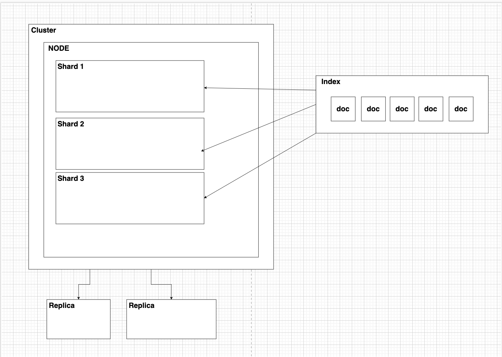

Etape 1: tirer l'image elastic search grâce à la commande suivante :

```
docker pull docker.elastic.co/elasticsearch/elasticsearch:8.7.1
```

Etape 2 : Créer un réseau elastic search :

```
docker network create elastic
```

Etape 3: lancer l'instance docker elastic search :

```
docker run --name es01 --net elastic -p 9200:9200 -it docker.elastic.co/elasticsearch/elasticsearch:8.7.1
```

Etape 4 : Récupérer le mots de passe pour l'utilisateur elastic et l'enrollement token

Etape 5 : Copier le certificat http_ca.crt dans l'instance docker

```
docker cp es01:/usr/share/elasticsearch/config/certs/http_ca.crt .
```

Etape 6 : Essayer de se connecter à elastic search en faisant un appel authentifier

```
curl --cacert http_ca.crt -u elastic https://localhost:9200
```

Etape 7 : Installer kibana dans docker

```
docker pull docker.elastic.co/kibana/kibana:8.7.1
```

Etape 8 : Lancer Kibana dans docker

```
docker run --name kib-01 --net elastic -p 5601:5601 docker.elastic.co/kibana/kibana:8.7.1
```

Etape 9 : Copier le lien dans le terminal et l'ouvrir dans le navigateur

Etape 10 : Se connecter avec les login elastic search

TP-1 Elasticsearch

Procédez à l’installation d’ElasticSearch et Kibana et Logstash sur votre machine :

- [https://www.elastic.co/guide/en/elasticsearch/reference/current/install-elasticsearch.html](https://www.elastic.co/guide/en/elasticsearch/reference/current/install-elasticsearch.html)
- Documentez toutes les étapes sur un dépôt Git

Procédez à l’indexation des documents présenté en Cours.

●Créer un index

○Avec mapping explicite

●Indexer des documents

●Indexer des documents en lots (bulk)

●Rechercher dans les documents

○Via Kibana

○Via API REST

●Modifier la configuration d’un index

Création d’index : [https://www.elastic.co/guide/en/elasticsearch/reference/current/indices-create-index.html](https://www.elastic.co/guide/en/elasticsearch/reference/current/indices-create-index.html)

Depuis la plateforme Kaggle, récupérez et indexez un jeu de données conséquent qui servira de base à votre projet sur la semaine.

Exercices sur le mapping :

- Comment Elasticsearch procède-t-il au mapping ?
  il se base sur le premier document pour créer automatiquement le mapping de l'index, mais l'utilisateur peut suggérer le maping de l'index en insérant le document.
- Modifier un index pour affecter un mapping explicite
- Peut-on modifier le mapping sans recréer l’index ?
  non, il faut créer un index en précisant le mapping puis copier les données de l'ancien index vers le nouvel index.

Exercices sur l’analyseur :

- [https://www.elastic.co/guide/en/elasticsearch/reference/current/analysis.html](https://www.elastic.co/guide/en/elasticsearch/reference/current/analysis.html)
- Tentez de définir : Tokenisation et Normalisation 
  La Tokenisation permet de découper une phrase en token (mots), ce qui permet une recherche plus vaste qu'une recherche littérale sur toute la chaine, chaque mot (token) est recherché afin d'avoir des matchs par tokens et non des matchs qui contiennent mot pour mot la phrase recherché.
  Cependant la tokenisation permet uniquement la recherche litérale de chaque mot mais ne permet pas la recherche de mot légèrement différent mais pertinant,La Normalisation permet cela, en modifiant les mots dans le but de les normaliser, par exemple, un mot contenant une majuscule sera mis en minuscule, un mot au pluriel sera mis au singulier, et un synonyme sera indexé par un synonyme plus commun.

Les APIs:

Lors de la démonstration nous avons évoqué la notion d’API, desquelles avons-nous parlé ?

Nous avons parler des APIs de Document (CRUD), qui permettent d'indexer un document, d'indexer des documents en masse (bulk), supprimer un document, mettre à jour un document,
Nous avons aussi parler des APIs d'index, qui permettent de mettre à jour un index, créer un index, afficher le mapping d'un index,...

[https://www.elastic.co/guide/en/elasticsearch/reference/current/rest-apis.html](https://www.elastic.co/guide/en/elasticsearch/reference/current/rest-apis.html)



Expliquez alors comment Elasticsearch stocke ses données et comment certaines de ces notions permettent de gagner en robustesse (en termes de sauvegarde et d’intégrité des données).

Terminez en résumant les fonctionnalités de mise à l’échelle… (diapo 148 et +)

Elasticsearch stocke ses données (documents) dans des indexes (similaire aux tables en sql), ces indexes sont divisés dans des espaces de stockages appelé shards qui sont reparties sur plusieurs noeud du cluster. Chaque Shard possède une ou plusieurs sauvegarde appelés replicas qui sont aussi répartis dans plusieurs noeud, ce qui permet une redondance des données et éviter les pertes des données lorsqu'un noeud disfonctione.

Pour scaler son cluster, on peut :

- rajouter des shards (pour ajouter du stockage, mais pas trop car cela peut surconsommer les ressources)
- rajouter des noeuds (pour rajouter de la puissance)
- rajouter des réplicas (pour rajouter de la redondance en cas de panne)
  les données sont automatiquement répartie entre les noeuds, ce qui permet une mise à l'échelle simple et une utilisation équilibré des ressources,

B – Testez la Scroll API : [https://www.elastic.co/guide/en/elasticsearch/reference/current/scroll-api.html](https://www.elastic.co/guide/en/elasticsearch/reference/current/scroll-api.html)

D’après vos recherches pourquoi l’utiliser ? Est-ce le bon paramètre de recherche pour effectuer de la recherche paginée ?

on peut l'utiliser pour afficher uniquement ce que l'utilisateur souhaite voir ce qui permet d'éviter de charger des données inutilement, cependant, ce paramètre n'est pas adapté pour faire de la recherche paginée car ce sont 2 solutions différentes.

C- Kibana :

- Quel est l’usage principal de Kibana ?

  Kibana est un outils qui permet principalement la visualisation et l'analyse des données elastiquesearch.

- Qu’est-ce qu’un Dashboard ?

  Dans Kibana, un Dashboard est une interface personnalisée qui regroupe et affiche différentes visualisations, graphiques et tableaux de données pour offrir une vue d'ensemble et faciliter l'analyse des données.

- [https://www.elastic.co/fr/kibana/kibna-dashboard](https://www.elastic.co/fr/kibana/kibana-dashboard)

- Créer une data view (index pattern)
- Explorer les données (Discover)
  
- Créer deux visualisations
  
  
- Créer un dashboard
  

Observer un schéma d’index dans Kibana
